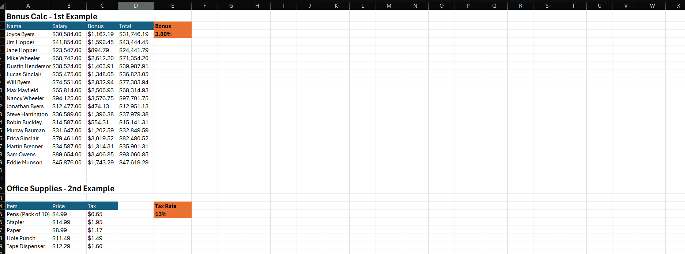

# 📊 ExcelProjects-101

This repository contains a collection of Excel-based data analysis projects designed to solve real-world problems through formulas, pivot tables, charts, and decision-making tools. Each project demonstrates practical skills in data cleaning, visualization, and business analysis.

## 📂 Projects Included

### EXCEL
- **Payroll**: Processes salaries, deductions, and net pay with summary reports.
- **Travel Budget Analysis**: Plans and tracks travel expenses against budget.
- **Sales Dashboard**: Monitors sales trends, product performance, and customer data.
- **Career Decisions**: Uses weighted decision matrices to compare career options.
- **Store Price Comparisons**: Analyzes store prices to identify the best deals.
- **Gradebook**: Automates grade calculations, averages, and performance visualizations.
- **Car Inventory**: Tracks stock, pricing, and vehicle models with pivot charts for quick insights.
- **Pet’s Yearly Costs**: Tracks annual expenses for better budget planning.
- **Absolute vs Relative CR**: Shows some examples of absolute vs relative cell references.
- **Loan Comparison**: Evaluates loan terms, interest rates, and monthly payments.

## 📸 Screenshots

### **Payroll**

### **Travel Analysis**

### **Sales Dashboard**

### **Career Decisions**

### **Store Comparison**

### **Gradebook**

### **Car Inventory**

### **Pet’s Yearly Costs**

### **Relative vs Absoulute Cell References**

### **Loan Comparison**

## 🛠 Skills Demonstrated
- Excel formulas and functions
- Pivot tables and pivot charts
- Data visualization
- Cost-benefit analysis
- Decision matrices
- Budget tracking

💡 Each file in this repository is a standalone Excel project that can be opened in Microsoft Excel or compatible spreadsheet software.
